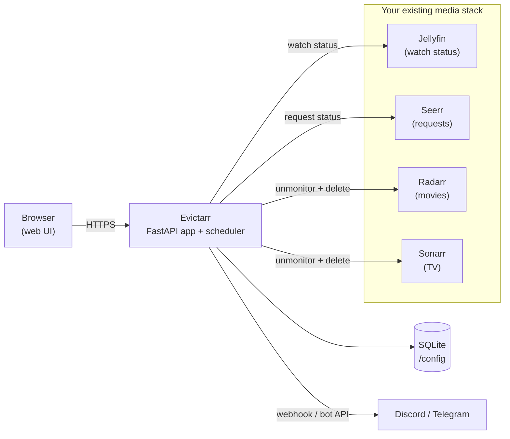
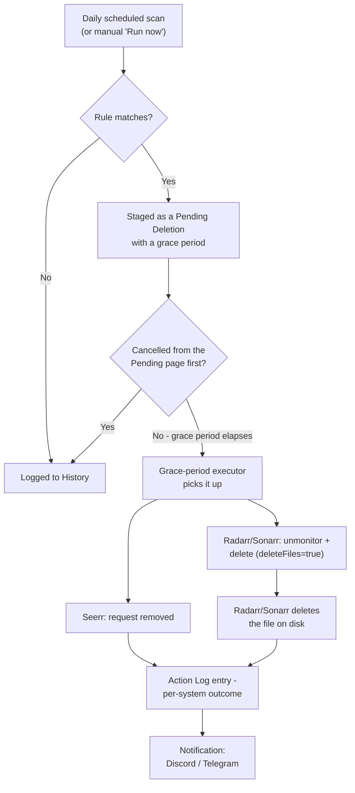

# Getting Started

## What is Evictarr?

Evictarr is a cleanup companion for a self-hosted media stack built on
Jellyfin, Jellyseerr/Overseerr ("Seerr"), Radarr and Sonarr. It watches your
library for things nobody's going to watch again - movies and shows you've
already finished, or requests that were granted and then never watched - and
removes them automatically, on a schedule, with a safety net.

The problem it solves: Radarr and Sonarr are great at *adding* media, but
they have no opinion about when to remove it. Left alone, a library only
grows. Evictarr is the other half of that lifecycle - it decides what's
safe to delete, tells you before it happens, and only actually deletes
after a grace period you control.

Nothing gets deleted the moment it's matched. Every match is staged in a
**Pending Deletions** queue behind a configurable grace period, cancellable
at any time before it executes.

## Architecture

Evictarr ships as a single Docker container - one image serving both the
API and the built web UI - that joins the same Docker network your existing
Jellyfin/Seerr/Radarr/Sonarr stack already runs on. It doesn't stand up any
of those services itself; it's a client of all of them.

A few things that fall out of this design:

- **No database server to run.** Evictarr uses an embedded SQLite database
  stored in its own `/config` volume, the same convention Sonarr and Radarr
  use - no separate Postgres/MySQL container to provision or back up.
- **No files are deleted by Evictarr directly.** When something is due for
  removal, Evictarr calls Radarr's or Sonarr's own delete API with
  `deleteFiles=true` - Radarr/Sonarr (which already have your media mounted)
  perform the actual file removal. Evictarr never needs write access to your
  media library for this. (It optionally *reads* your library, read-only,
  for the separate Orphaned Files report - see below.)
- **A single process handles everything.** The web API and an in-process
  scheduler (daily rule scan + a periodic grace-period executor) run
  together in one container - no separate worker process to deploy.

## How it works

The core loop - a rule match becoming an actual deletion - looks like this:

1. **A rule scan runs** - once a day on a schedule you set, or on demand
   from the Rules page.
2. **Each enabled rule is evaluated** against live data pulled from
   Jellyfin/Seerr/Radarr/Sonarr (nothing is cached long-term - every scan
   asks the real services what's currently true).
3. **Matches are staged**, not deleted, as a `Pending Deletion` with a
   grace period (default 24h, configurable per install and overridable
   per rule).
4. **You can cancel anything** from the Pending Deletions page for as long
   as it's still within its grace period.
5. **A background executor** (running on its own interval, default every
   15 minutes) picks up anything whose grace period has elapsed and
   actually performs the removal: the Seerr request is deleted, and
   Radarr/Sonarr are told to unmonitor and delete the file.
6. **Every attempt is logged** to History with a per-system outcome
   (Seerr / Radarr-or-Sonarr / disk), even partial failures.
7. **Notifications fire** (if configured) when something is staged, when
   something is actually deleted, and with a daily summary after each
   scheduled scan.

## Features

### Integrations

Configured from **Settings > Integrations**: base URL + API key for each of
Jellyfin, Seerr, Radarr and Sonarr, with a "test connection" button per
service. Any service can be left disabled - rules that need it are simply
skipped rather than erroring, so you can run Evictarr against a partial
stack (e.g. no Seerr) if you don't use it.

### Rules engine

Three rule types, each with a threshold (a number + unit: hours / days /
weeks / months / years) and an optional "exempt favorites" toggle that skips
anything marked as a favorite in Jellyfin:

- **Movie watched cleanup** - a movie marked as played in Jellyfin, whose
  last-played date is older than the threshold.
- **Series watched cleanup** - the same idea for TV, at your choice of two
  granularities: whole **series** (the entire show is watched and past
  threshold) or individual **season** (each season evaluated and matched
  independently, so a show can be partially cleaned up season by season).
- **Stale request cleanup** - a Seerr request that was granted (media is
  available) but has **never been watched at all** since it was added, and
  that "added" date is older than the threshold. This catches requests
  people asked for and then never actually watched.

Multiple rules can be active at once, each independently scheduled to run
in the same daily scan.

### Deletion pipeline & Pending Deletions

Every match becomes a `Pending Deletion` - visible on the Pending page with
its grace period countdown. Cancelling one is a single click, any time
before it executes. Once the grace period elapses, the periodic executor
picks it up and calls the real APIs (Seerr, then Radarr/Sonarr). Grace
period length and executor check interval are both configurable from
**Settings > General**.

### Notifications

Optional Discord webhook and/or Telegram bot, each independently
configurable and testable from **Settings > Notifications**, with
per-channel toggles for: notify when something is staged, notify when
something is actually deleted (including partial failures), and a daily
summary after each scheduled scan.

### History

Two tabs answering "what happened, and when":

- **Scans** - every rule evaluation, scheduled or manual, with counts of
  items scanned/matched/skipped and the reason for every match or notable
  skip.
- **Deletions** - every actual deletion attempt, with the outcome recorded
  separately for Seerr, Radarr/Sonarr, and disk.

### Orphaned Files

A separate, read-only report (**Orphaned Files** page) that compares the
files actually sitting in your `/movies`/`/shows` mounts against what
Radarr/Sonarr report tracking via their own APIs. Anything present on disk
that neither system knows about - leftovers from a manual deletion, a
failed import, stray extras - gets flagged for you to review and clear
yourself. It never deletes anything; it's a report, not a rule. This is
the one feature that needs Evictarr to see your media library directly
(mounted read-only) - everything else works purely through the four APIs.

### Authentication

Off by default - Evictarr opens with no login wall on first run, matching
how Sonarr/Radarr themselves behave out of the box. From **Settings >
Security** you can switch to Basic authentication (a username/password
session login) at any point, with optional TOTP two-factor authentication
and self-service password change layered on top once it's enabled.

## Next steps

- [Installation](installation.md) - get Evictarr running
- [Support](SUPPORT.md) - where to ask questions or report bugs
- [Security](SECURITY.md) - how to report a vulnerability
